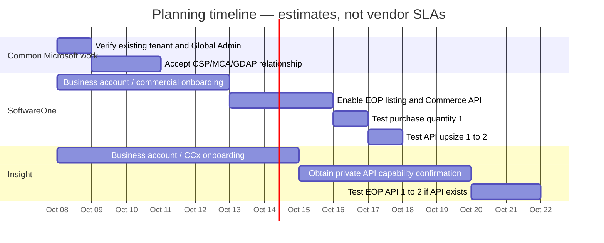
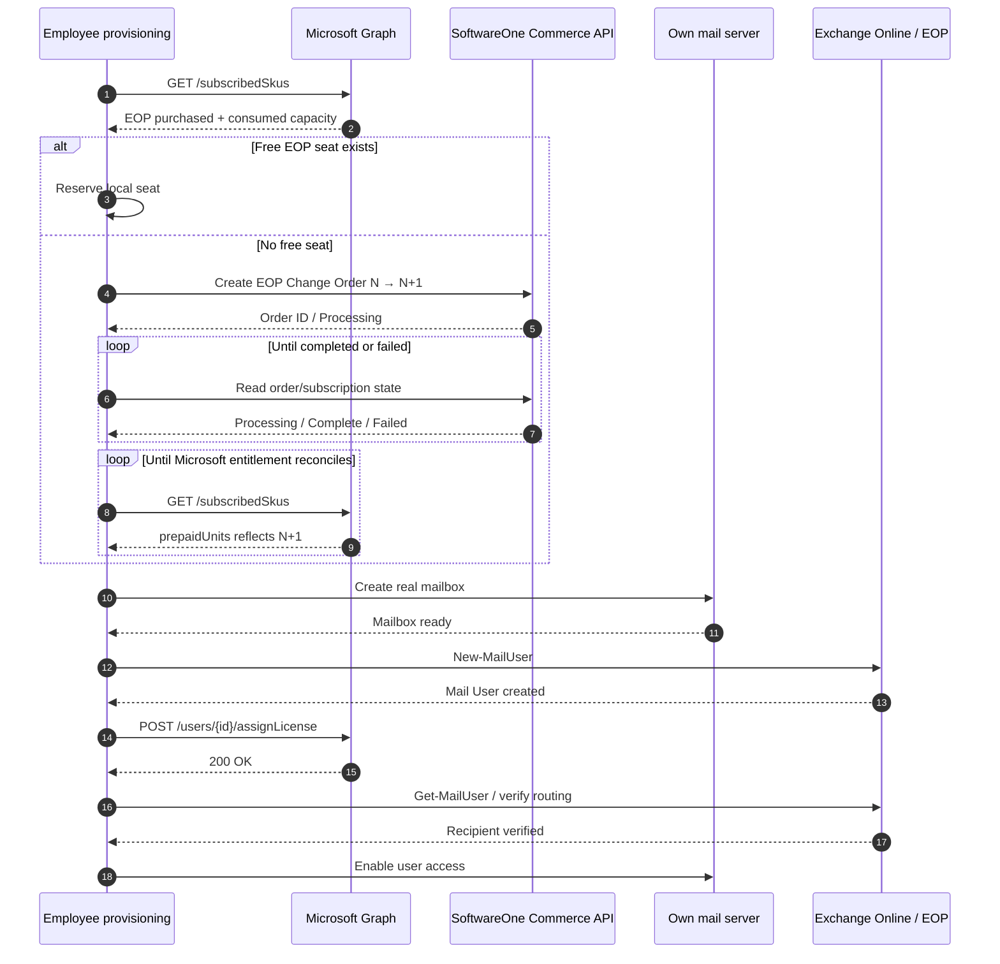

<!-- Research report supplied by the owner on 2026-10-07; kept verbatim except for citation markers and example hosts replaced with placeholders. Not verified by us: every vendor claim is to be confirmed in the acceptance test it describes. -->

# Technical Report: SoftwareOne vs. Insight USA for Programmatic Microsoft EOP Licensing

## Executive summary

For a US company that wants to run its own mailbox infrastructure while using Microsoft **Exchange Online Protection**, now marketed as **Built-in security add-on for on-premises mailboxes**, and that specifically wants to automate commercial seat increases such as `1 → 2 → 3 → … → N` without a human buying each seat, **SoftwareOne is materially better supported by the public technical evidence than Insight**. Microsoft continues to identify the underlying licensable SKU in Entra/Graph as `EOP_ENTERPRISE`, with SKU GUID `45a2423b-e884-448d-a831-d9e139c52d2f`; Microsoft also explicitly documents `New-MailUser` as applicable to the renamed standalone EOP product.

The key finding is:

| Requirement | SoftwareOne | Insight USA |
|---|---|---|
| US end-customer CSP model | **Yes** | **Yes** |
| Standalone EOP / renamed product | **Microsoft CSP catalog supported; exact US listing ID must be confirmed** | **Yes; Insight explicitly announced the EOP rename in CCx** |
| Start at one seat | **Platform supports `quantity: 1`; EOP-specific minimum not publicly confirmed** | **CCx quantity mechanics support a single license generically; EOP-specific minimum not publicly confirmed** |
| Increase seats after purchase | **Yes, Change Order model explicitly supports additional licenses** | **Yes in CCx portal** |
| Customer-facing REST API | **Yes** | Generic procurement APIs exist, but no public CCx subscription-lifecycle API found |
| Publicly documented API for N→N+1 | **Strong evidence: Commerce API + Change Orders** | **Not publicly documented** |
| API token independently created by client admin | **Yes** | Not publicly documented for CCx |
| Exact REST endpoint to initiate commercial order | **`POST /public/v1/commerce/orders`** | **No public endpoint found** |
| API authentication | **Bearer API token** | **Not publicly documented for CCx quantity operations** |
| API rate limits | **Not publicly documented** | **Not publicly documented** |
| Suitable as primary provider | **Yes, after vendor acceptance test** | **Only conditionally** |
| Overall API confidence | **High at platform level; EOP-specific validation still required** | **Low until Insight supplies private API documentation** |

SoftwareOne's current documentation is unusually explicit: the Marketplace Platform provides a REST API, client administrators can generate API tokens, `POST /public/v1/commerce/orders` is available to the **client** role, and a **Change Order** is explicitly defined as the mechanism for downsizing or ordering additional licenses. The documented Order object even illustrates an upsize line and a separate new-purchase line with `quantity: 1`.

Insight is a good US CSP operationally. Its CCx platform officially supports Microsoft NCE products, immediate provisioning, quantity increases, renewal management, Microsoft Customer Agreement handling, invoices and credit-card/payment-term billing. Insight also announced in February 2026 that EOP had been renamed in its CCx environment to **Built in security Exchange on-premise mailbox add-on**. However, I could not find a public Insight document exposing an API equivalent to SoftwareOne's Commerce API for **changing a Microsoft CSP subscription quantity**. Insight documents procurement APIs such as Order Placement, Order Status, Tracking and Invoice Status, but those do not by themselves establish that an end customer can execute a CCx Microsoft license upsize through REST.

**Therefore the architecture decision should be: SoftwareOne = primary; Insight = contingency only if Insight supplies private/customer API documentation and successfully demonstrates an EOP `1 → 2` change via that API.**

One additional technical correction is important. Microsoft Graph's `assignLicense` API does **not buy another seat**. Microsoft describes it as assigning to a user a license that the organization has already acquired. `GET /subscribedSkus` similarly reads commercial subscriptions already acquired. The commercial quantity change belongs at the CSP/commerce layer, which is precisely why SoftwareOne's API is relevant.

## Product identity and catalog mapping

The marketing name, Microsoft licensing identifier and reseller-catalog identifier are three different things and should not be conflated.

Microsoft renamed standalone Exchange Online Protection to **Built-in security add-on for on-premises mailboxes**. Microsoft states that this standalone service can protect on-premises Exchange as well as other SMTP email systems, which matches the proposed self-hosted-mail architecture.

At the Microsoft Entra/Graph licensing layer, the current identifiers are:

| Field | Microsoft identifier |
|---|---|
| Product | Exchange Online Protection |
| Current marketing name | Built-in security add-on for on-premises mailboxes |
| `skuPartNumber` | `EOP_ENTERPRISE` |
| `skuId` | `45a2423b-e884-448d-a831-d9e139c52d2f` |
| Service plan name | `EOP_ENTERPRISE` |
| Service plan ID | `326e2b78-9d27-42c9-8509-46c827743a17` |

Microsoft's current licensing-reference table is the authoritative source for the Graph/Entra identifiers.

This should **not** be confused with `EOP_ENTERPRISE_PREMIUM` / Exchange Enterprise CAL Services, which is a different Microsoft SKU.

**SoftwareOne.** SoftwareOne's catalog architecture separates Products, Items and Listings. An **Item** represents an individual stock-keeping/transactable unit, while a **Listing** connects a product with a particular SoftwareOne seller. The Marketplace IDs visible to APIs therefore look like SoftwareOne object identifiers such as `ITM-…`, `LST-…`, `PRD-…`, etc.; these are not the Microsoft Graph `skuId`.

I did **not** find a publicly indexed SoftwareOne US page disclosing the current `ITM-…` or `LST-…` identifier for standalone EOP. That is not necessarily a problem: the correct automation design is to discover/store the authorized listing from the customer's SoftwareOne catalog after onboarding rather than hard-code an assumed reseller catalog ID. This is an explicit item to validate with SoftwareOne.

**Insight.** Insight published a February 2026 Cloud Care update saying Microsoft had rebranded EOP to **Built in security Exchange on-premise mailbox add-on**, and said active subscriptions would receive the new name in CCx. This is strong first-party evidence that Insight's CCx handles the product.

However, I found no public Insight US page exposing a stable CCx internal product/SKU identifier for that offer. Consequently, automation should not assume that the Microsoft Graph GUID or `EOP_ENTERPRISE` string is the ID expected by Insight's commercial platform.

The practical mapping should become:

```text
Microsoft technical identity
    skuPartNumber = EOP_ENTERPRISE
    skuId         = 45a2423b-e884-448d-a831-d9e139c52d2f

                ⇅ mapping stored by us

SoftwareOne
    productId / itemId / listingId discovered after account activation

or

Insight
    CCx offer/subscription identifier supplied by Insight
```

The absence of a public reseller listing ID is not itself a blocker. The blocker would be a vendor refusing to expose a transactable EOP offer through the customer's API-enabled catalog.

## API capability and quantity automation

### SoftwareOne

SoftwareOne's technical position is substantially clearer.

The base API is:

```text
https://api.platform.softwareone.com/public/v1/
```

Authentication is with a Marketplace **API token** sent as:

```http
Authorization: Bearer <TOKEN>
Content-Type: application/json
```

SoftwareOne explicitly instructs clients to keep these keys private, never place them in client-side code or public repositories, and use HTTPS for all API calls.

The important Commerce API abstraction is the **order**. SoftwareOne defines:

- Purchase Order — buy a new product/service and establish a new agreement.
- Change Order — change quantity, including ordering additional licenses.
- Termination Order.
- Configuration Order.

That definition is explicit in the official Commerce documentation.

The customer-accessible creation endpoint is:

```http
POST https://api.platform.softwareone.com/public/v1/commerce/orders
Authorization: Bearer <TOKEN>
Content-Type: application/json
```

SoftwareOne marks **Create order** as accessible to the `client` role. This matters: some lower-level Commerce operations such as directly creating a subscription are marked `vendor` only, so your integration should create **commercial orders**, not attempt to act as the SoftwareOne vendor backend.

This corrects an easy misunderstanding of their documentation:

```text
DO:
client → Create Purchase/Change Order → SoftwareOne/vendor fulfillment
                                            ↓
                                      subscription changes

DON'T:
client → directly "create vendor subscription"
```

The published Order model contains an example with:

```json
{
  "lines": [
    {
      "item": {
        "id": "ITM-1234-1234-1234-0021"
      },
      "quantity": 10,
      "subscription": {
        "id": "SUB-1234-1234-1234"
      }
    },
    {
      "item": {
        "id": "ITM-4444-4444-4444-0031"
      },
      "quantity": 1
    }
  ]
}
```

The first line is explicitly labeled an **Upsize** in SoftwareOne's documentation; the second is a new purchase with `quantity: 1`.

That establishes two important platform capabilities:

1. SoftwareOne's order data model supports an initial quantity of one.
2. It supports upsizing an existing subscription through a Change Order.

It does **not**, by itself, prove that the specific US EOP listing has no reseller-imposed minimum above one. That last fact is not publicly documented and must be part of the commercial acceptance test.

An EOP-specific Change Order will require the actual SoftwareOne `agreement`, `subscription`, `listing/item`, and possibly Microsoft tenant/order parameters supplied by the authorized listing. SoftwareOne's own generic Order example demonstrates that Microsoft-oriented orders can include fulfillment/ordering parameters such as a tenant ID and Microsoft Partner ID.

Therefore an illustrative—not copy/paste production—upsize request will conceptually be:

```http
POST /public/v1/commerce/orders
Authorization: Bearer <SOFTWAREONE_TOKEN>
Content-Type: application/json

{
  "type": "Change",
  "agreement": {
    "id": "AGR-..."
  },
  "lines": [
    {
      "item": {
        "id": "ITM-...EOP..."
      },
      "subscription": {
        "id": "SUB-...EOP..."
      },
      "quantity": 61
    }
  ],
  "externalIds": {
    "...": "employee-provisioning-2026-10-000123"
  }
}
```

**Caution:** SoftwareOne does not publish a static EOP-specific request example showing the exact required template parameters, nor did I find an official public specification confirming whether `quantity` on an EOP change line means the new absolute quantity or a delta in every flow. Those details must be obtained from the account's live listing/template or SoftwareOne support before implementing the production payload. The platform-level mechanism itself is documented.

SoftwareOne exposes order states and subscription states. A commercial operation may transition through provisioning/updating and fail if the vendor rejects it; importantly, a successful HTTP request is therefore **not equivalent to a Microsoft seat already being usable**.

An illustrative response shape from the public Order object is:

```json
{
  "id": "ORD-6869-4529-8975-9005",
  "agreement": {
    "id": "AGR-2119-4550-8674-5962"
  },
  "type": "Purchase",
  "status": "Processing",
  "statusNotes": {
    "message": "..."
  },
  "lines": [
    {
      "item": {
        "id": "ITM-..."
      },
      "quantity": 1
    }
  ]
}
```

SoftwareOne's published errors follow a problem-details structure with fields such as `title`, `status`, `detail`, `traceId`, and field-level `errors`. Publicly documented classes include `400`, `401`, `403`, `404`, `409`, `415`, `500`, `501`, and `504`.

**Rate limiting:** I found no official public SoftwareOne Marketplace documentation specifying requests-per-second/minute limits, a documented `429` policy, or `Retry-After` semantics. Treat that as unknown and ask SoftwareOne. The API does document pagination constraints such as a maximum list limit of 100 for relevant RQL/list interfaces, but that is not an API request-rate limit.

### Insight USA

Insight CCx is well documented as a **portal-based** Microsoft subscription-management platform. Its US documentation says direct customers get a CCx Administrator account and can purchase/manage Microsoft CSP products. CCx handles reseller-relationship approval, MCA state, Microsoft validation, immediate provisioning of license-based products and changes to subscription quantities.

Insight's quantity-management documentation states that quantity can be increased during the term, performs a Microsoft validation/update, shows the per-unit price and prorates the added quantity across the remainder of the subscription term. It also says that when an active subscription has only one license, it must be canceled rather than reduced to zero. This is good evidence that the CCx/NCE lifecycle supports `quantity = 1` generically.

But this is the key distinction:

> **I found no public Insight CCx REST endpoint that a direct US customer can call to change a Microsoft CSP subscription from N to N+1.**

Insight does advertise integration/e-procurement APIs, including Order Placement, Order Status, Tracking and Invoice Status, and can configure electronic procurement integration through the customer's Insight sales relationship.

That is not enough evidence to claim:

```http
PATCH /ccx/microsoft/subscriptions/{id}
{
  "quantity": 61
}
```

No such publicly documented endpoint, authentication method, request schema, rate limit or error model was located.

Accordingly:

| API property | SoftwareOne | Insight |
|---|---|---|
| Public REST docs | **Yes** | Procurement APIs described, detailed CCx subscription API not public |
| Client API authentication | **Bearer API token documented** | Not documented publicly for CCx quantity |
| Commercial order endpoint | **`POST /public/v1/commerce/orders`** | Not publicly documented |
| Change-order concept | **Explicitly documented** | CCx portal quantity management documented |
| Client role allowed to create orders | **Yes** | Unknown for equivalent API |
| EOP N→N+1 by API | **Platform supports mechanism; EOP offer must be validated** | **Unproven publicly** |
| Rate limit | Not published | Not published |
| Error schema | Documented | Not public for CCx quantity |
| Production recommendation | **Proceed to acceptance test** | **Do not code against it until Insight supplies API spec** |

This is the biggest conclusion of the research: **Insight should not currently be presented internally as an API-equivalent fallback to SoftwareOne.** It is a strong CSP/self-service fallback, but API equivalence remains an unanswered vendor question.

## Onboarding, tenant relationship, and commercial terms

Both options let the company retain its existing Microsoft tenant. You should not create a new tenant merely because you are changing the party that bills Microsoft subscriptions. Microsoft documents the normal CSP relationship flow as the partner sending an invitation and the customer accepting that relationship in Microsoft 365 Admin Center.

**SoftwareOne onboarding.** The publicly documented pieces are:

```text
US company / SoftwareOne client account
          ↓
SoftwareOne Marketplace account
          ↓
existing Microsoft tenant identified
          ↓
Microsoft CSP / reseller relationship
          ↓
MCA status checked/accepted
          ↓
GDAP relationship requested where required
          ↓
EOP order
          ↓
Marketplace Account Admin creates API token
```

SoftwareOne documents that MCA acceptance is required before Microsoft CSP provisioning; if the agreement is not accepted, an order can remain in a querying state until the customer accepts the agreement.

SoftwareOne's CSP instructions require the tenant/domain information to match Microsoft and require the person establishing the Microsoft relationship to be a valid member of the tenant with the necessary administrator authority; their workflow uses a Global Administrator to approve the relationship.

SoftwareOne also documents customer-admin creation of Marketplace API tokens. API capabilities are permissioned, so the relevant Marketplace/Commerce API capabilities must be enabled for your account.

I found **no authoritative public SoftwareOne US checklist** promising that onboarding requires exactly a W-9, EIN letter, D-U-N-S record, articles of incorporation, bank letter, or a particular credit-verification document. Likewise, no official page found in this research promises “account activation in X business days.” Those details should therefore be treated as sales/credit-policy variables, not facts.

For project planning, I would reserve **roughly one to two calendar weeks** for business-account approval, Microsoft relationship acceptance, catalog enablement and an API test. This is an engineering contingency, **not a SoftwareOne SLA or published onboarding promise**.

**Insight onboarding.** Insight's CCx documentation establishes the Microsoft-side steps more clearly than its API-onboarding steps. A direct customer receives CCx administrative access, establishes/validates the Microsoft reseller relationship, has MCA status handled and has GDAP checked during Microsoft workflows.

Insight's e-procurement material says integrations are coordinated through the Insight sales representative; the sales relationship configures the customer's electronic purchasing environment.

Again, no authoritative public US onboarding page I found gives a guaranteed document list or fixed activation time for a new corporate customer plus private API enablement. I would reserve **one to three calendar weeks if a custom/private API integration is needed**, but that is a planning allowance rather than an Insight commitment.

A realistic timeline is therefore:



The exact dates above are deliberately illustrative project-planning dates, not promises by either vendor.

**Reseller relationship versus delegated administration.** These should be treated separately. A CSP/reseller relationship lets a partner transact Microsoft products for your tenant. **GDAP** gives the partner delegated access to specific administrative roles/workloads. Microsoft's purpose for GDAP is precisely to reduce partner access to granular, least-privileged roles rather than broad tenant administration.

SoftwareOne explicitly documents GDAP as part of its Microsoft CSP operations and has role-assignment guidance. Insight likewise integrates GDAP management/verification into CCx's Microsoft workflows.

For your architecture, ask both vendors to justify **each** GDAP role. Purchasing EOP seats does not logically justify unrestricted day-to-day Global Administrator access to your tenant.

**MCA.** SoftwareOne checks Microsoft Customer Agreement status and has a defined acceptance flow. Microsoft also supports CSP-side MCA attestation APIs for eligible CSP partners, although indirect resellers have different attestation rules. The cleanest governance model for your company is to retain evidence that your own authorized administrator accepted the applicable Microsoft agreement.

**NCE seat economics.** Microsoft's current New Commerce rules permit increasing the license count at any time; billing adjustments appear on the next invoice, and seats added to the existing subscription keep the same subscription end date. Reductions are generally allowed only within seven days after those licenses are added; afterwards the quantity normally remains committed until the next permitted renewal/change window.

Microsoft's billing documentation also describes prorated charge/refund mechanics when license quantities change.

Insight mirrors these mechanics explicitly in CCx: added licenses are prorated for the remaining term and each addition receives its applicable 168-hour reduction window.

For SoftwareOne, the underlying Microsoft NCE commercial mechanics apply at the Microsoft-CSP layer, but **your actual invoice timing, reseller margin/unit price, payment terms and payment instruments are governed by your SoftwareOne customer agreement and quote**. I did not find an authoritative public SoftwareOne US page guaranteeing a particular credit-card or Net-30 policy for every customer.

Insight publicly documents CCx payment/invoice functionality including invoicing/payment terms and credit-card management for direct customers. Exact credit terms remain account-specific.

Consequently the cost comparison at this stage is:

| Commercial issue | SoftwareOne | Insight |
|---|---|---|
| EOP unit price | **Quote/account catalog required** | **Quote/CCx catalog required** |
| Initial quantity=1 price | Must validate | Must validate |
| Mid-term increase | Microsoft NCE allows it; Change Order supported | Explicitly supported in CCx |
| Mid-term added seat proration | Underlying NCE mechanics; reseller invoice treatment should be confirmed | Explicitly documented |
| Reduction window | Microsoft NCE rules apply | CCx explicitly documents 168 hours |
| Credit card | Account terms not conclusively established publicly | CCx supports card management |
| Invoice/payment terms | Contract-specific | Supported, contract-specific |
| Support SLA for licensing API | No public guaranteed API SLA found | No public CCx quantity-API SLA found |

**Transfers.** Microsoft has a formal process for transfers of existing New Commerce subscriptions between CSP partners; financial responsibility transfers during the term and prepaid source partners can receive prorated treatment for the remaining term.

SoftwareOne's own current documentation also advertises migration scenarios including **Microsoft Direct (MCA) → CSP**. This should not be interpreted as proof that every Web Direct subscription is transformed in place with its subscription ID unchanged; ask SoftwareOne whether EOP is migrated, recreated, co-termed, or temporarily overlaps.

For Insight I did not find equally explicit public documentation in this research for a Web-Direct-to-CCx EOP migration. If you already have direct Microsoft EOP, this should be a pre-contract question.

## End-to-end provisioning architecture

The automation should keep three control planes separate:

```text
SoftwareOne
Commercial entitlement
How many EOP seats have we bought?

Microsoft Graph / Exchange Online
Tenant identity + Mail User + license assignment
Who is protected/routable?

Our mail platform
Actual mailbox/storage
Where does the user's mail live?
```

Microsoft Graph's `GET /subscribedSkus` tells you what commercial subscriptions the organization has acquired and exposes the license SKU information needed to calculate capacity. It requires `LicenseAssignment.Read.All` at minimum for application access.

Graph's license-assignment endpoint is:

```http
POST https://graph.microsoft.com/v1.0/users/{id-or-UPN}/assignLicense
```

with application permission:

```text
LicenseAssignment.ReadWrite.All
```

as Microsoft's least-privileged documented application permission for this action.

For EOP the request is conceptually:

```http
POST https://graph.microsoft.com/v1.0/users/alice@example.com/assignLicense
Authorization: Bearer <GRAPH_TOKEN>
Content-Type: application/json

{
  "addLicenses": [
    {
      "skuId": "45a2423b-e884-448d-a831-d9e139c52d2f",
      "disabledPlans": []
    }
  ],
  "removeLicenses": []
}
```

The `skuId` above is Microsoft's official `EOP_ENTERPRISE` SKU. In production I recommend resolving it from `/subscribedSkus` by `skuPartNumber == "EOP_ENTERPRISE"` rather than relying only on a hard-coded GUID.

The Mail User is created through Exchange Online PowerShell. Microsoft specifically marks `New-MailUser` as applicable to the **Built-in security add-on for on-premises mailboxes**. A Mail User has an Exchange mail-enabled identity but no Microsoft Exchange mailbox; mail sent to it is delivered to its external address.

For example:

```powershell
$password = ConvertTo-SecureString $GeneratedPassword -AsPlainText -Force

New-MailUser `
    -Name "Alice Example" `
    -Alias "alice" `
    -MicrosoftOnlineServicesID "alice@example.com" `
    -ExternalEmailAddress "alice@<MAIL_HOST>" `
    -Password $password
```

Microsoft's own example uses the same basic `New-MailUser` pattern with `ExternalEmailAddress`, Microsoft online identity and password.

For unattended Exchange Online PowerShell, Microsoft supports certificate-based app-only authentication. The application receives `Exchange.ManageAsApp`, tenant admin consent and an appropriate Exchange RBAC role; `Connect-ExchangeOnline` can then authenticate with the app ID, organization and X.509 certificate.

A production connection therefore resembles:

```powershell
Connect-ExchangeOnline `
    -AppId $AppId `
    -CertificateThumbprint $Thumbprint `
    -Organization "<TENANT>.onmicrosoft.com"
```

Microsoft recommends granular Exchange RBAC where possible rather than simply granting the automation service principal unrestricted administrative rights.

There is one sequencing issue worth changing from the original specification. The requested order was:

```text
seat → Mail User → license → own mailbox
```

Operationally I recommend creating the actual mailbox **before making the recipient deliverable**. Otherwise there is a window in which EOP knows that the recipient exists but your downstream server cannot yet accept the mailbox.

The safer workflow is:



The first Graph operation reads already-acquired subscriptions; it does not buy another seat. The commercial upsize belongs in SoftwareOne.

For Insight, the architecture can remain identical behind a provider interface:

```text
interface LicenseProvider {
    getSubscription()
    ensureQuantity(requiredQuantity)
    getOrderStatus(orderId)
}
```

with:

```text
SoftwareOneLicenseProvider
InsightLicenseProvider
```

But the Insight implementation should **not** be written until Insight supplies the CCx API specification. Today, only the SoftwareOne side has sufficient public evidence for that interface.

One Microsoft licensing detail should also be validated in the pilot: Graph clearly supports assignment of acquired licenses and Microsoft publishes `EOP_ENTERPRISE` as a license SKU, but I did not locate in this research an EOP-specific Microsoft page explicitly stating that every standalone-EOP Mail User must be assigned that SKU for mail-flow enforcement. Assigning a purchased entitlement per protected employee is sensible for licensing/accounting, but the precise technical enforcement behavior should be tested with the standalone EOP tenant before making license assignment a hard dependency of mail routing.

## Security, reliability, and reconciliation

The most dangerous automation mistake would be treating license purchase as a normal synchronous database update.

A call such as:

```text
create employee
→ POST upsize
→ HTTP success
→ immediately assign license
```

is unsafe because CSP fulfillment is asynchronous. SoftwareOne explicitly models an agreement as `Provisioning`/`Updating` while vendor work is in progress and a subscription can be `Updating` while a Change Order is being fulfilled.

Your internal state machine should instead be:

```text
REQUESTED
   ↓
COMMERCIAL_ORDER_CREATED
   ↓
CSP_PROCESSING
   ↓
MICROSOFT_CAPACITY_VISIBLE
   ↓
MAILBOX_CREATED
   ↓
MAIL_USER_CREATED
   ↓
LICENSE_ASSIGNED
   ↓
ACTIVE
```

If any step fails, the employee provisioning record remains resumable rather than being rolled back blindly.

**SoftwareOne API failures.** The published API provides structured problem information and a `traceId`, which should always be logged alongside your own provisioning ID.

Recommended handling:

| Condition | Action |
|---|---|
| `400` validation | Do not retry automatically; persist response and inspect listing/template parameters |
| `401` | Refresh/replace secret or token; alert |
| `403` | Treat as configuration/permission problem, not transient |
| `404` | Reconcile IDs against current listing/agreement/subscription |
| `409` | Re-read current commercial state; likely conflict/concurrent workflow |
| `415` | Programming error/content type; do not retry blindly |
| `500/504` | Retry reads with exponential backoff; reconcile before retrying any purchase |
| Connection timeout after POST | **Do not blindly POST the purchase again**; first search/reconcile existing orders |
| Unknown result | Compare SoftwareOne order, SoftwareOne subscription and Graph `/subscribedSkus` before taking another commercial action |

SoftwareOne's Order model includes `externalIds`, which is useful for attaching your own provisioning transaction reference. Because I found **no publicly documented idempotency-key header**, application-level deduplication is important.

For example:

```text
commercial_operation_id =
    "eop-upsize:tenant-123:target-61:employee-789"
```

Store:

```text
our_operation_id
SoftwareOne order_id
SoftwareOne subscription_id
old_quantity
requested_quantity
Microsoft skuId
created_at
last_observed_state
```

Before retrying an uncertain purchase, reconcile against that record.

Graph itself should be the final confirmation that Microsoft tenant capacity has materialized. Microsoft documents `/subscribedSkus` as returning commercial subscriptions acquired by the organization.

I would therefore use **two-phase capacity confirmation**:

```text
Phase A:
SoftwareOne order == completed

Phase B:
Graph EOP_ENTERPRISE prepaidUnits.enabled >= required quantity
```

Only Phase B unlocks license assignment.

**Concurrency must also be serialized.** If two employees arrive simultaneously when there are zero spare seats, both workers must not independently observe `60/60` and place `61-seat` orders. Use a distributed lock or database transaction keyed to:

```text
tenant_id + EOP_ENTERPRISE
```

and recompute the required quantity under that lock.

**SoftwareOne credentials.** Their APIs use bearer tokens; SoftwareOne explicitly warns against exposing them in public repositories or client-side code. Keep the token in a server-side secrets system, restrict who can retrieve it, log use without logging the token, and ask SoftwareOne about token expiration, scoped permissions, rotation, revocation, IP restrictions and whether separate production/staging tokens can be issued.

**Microsoft Graph credentials.** Use an application identity with:

```text
LicenseAssignment.Read.All
LicenseAssignment.ReadWrite.All
```

as required by your read/write operations; avoid `Directory.ReadWrite.All` when the narrower license permission suffices. Microsoft explicitly identifies `LicenseAssignment.ReadWrite.All` as the least-privileged application permission for `assignLicense`.

If your code separately creates or modifies Microsoft users through Graph, additional user permissions may be required. Do not grant them merely for licensing.

**Exchange PowerShell credentials.** Prefer certificate-based application authentication. Microsoft supports `Exchange.ManageAsApp` plus Exchange RBAC for unattended scripts and specifically recommends giving the application appropriate roles rather than assuming universal admin access.

**Partner access.** GDAP should be least-privileged and time-bounded where possible. Microsoft's GDAP model exists specifically to scope partner access. Ask SoftwareOne and Insight for the exact requested roles before clicking Accept; distinguish roles needed to provide support from roles actually necessary to sell the EOP subscription.

## Implementation checklist

The concrete implementation can be reduced to the following control flow.

| Layer | Call / command | Purpose | Required permission |
|---|---|---|---|
| SoftwareOne | `POST /public/v1/commerce/orders` | Initial Purchase or Change Order | SoftwareOne client API token with Commerce access |
| SoftwareOne | Read Order | Track fulfillment | Client Commerce API access |
| SoftwareOne | Read Subscription | Reconcile commercial subscription | Client Commerce API access |
| Graph | `GET /v1.0/subscribedSkus` | Read EOP purchased/consumed capacity | `LicenseAssignment.Read.All` |
| Exchange | `New-MailUser` | Create EOP mail-enabled recipient | Exchange RBAC + `Exchange.ManageAsApp` for app-only |
| Graph | `POST /v1.0/users/{id}/assignLicense` | Assign purchased EOP entitlement | `LicenseAssignment.ReadWrite.All` |
| Exchange | `Get-MailUser` | Verify recipient | Appropriate Exchange read RBAC |
| Own mail server | Vendor-specific create-mailbox API | Create actual mailbox | Local mail-platform credential |

The capacity check should locate:

```text
skuPartNumber == EOP_ENTERPRISE
```

rather than relying only on display names, because the marketing name has already changed while Microsoft's machine-readable licensing identifier remains `EOP_ENTERPRISE`.

A conceptual Graph capacity check is:

```http
GET https://graph.microsoft.com/v1.0/subscribedSkus
Authorization: Bearer <GRAPH_TOKEN>
```

Then select:

```json
{
  "skuPartNumber": "EOP_ENTERPRISE",
  "skuId": "45a2423b-e884-448d-a831-d9e139c52d2f"
}
```

The endpoint and required read permission are documented by Microsoft.

The application should compute roughly:

```text
available =
    prepaidUnits.enabled
    - consumedUnits
    - locally_reserved_not_yet_assigned
```

The local reservation component is essential to prevent parallel employee creations from oversubscribing the final seat.

For initial SoftwareOne provisioning:

```text
Discover/confirm EOP listing
        ↓
Purchase Order quantity = 1
        ↓
wait for order completion
        ↓
Graph confirms EOP_ENTERPRISE enabled quantity = 1
```

For subsequent employees:

```text
GET Graph subscribedSkus
        ↓
available > 0 ?
   yes          no
    ↓            ↓
 reserve       SoftwareOne Change Order
 seat           target N+1
                 ↓
           wait/reconcile
                 ↓
          Graph sees N+1
                 ↓
             reserve seat
```

Then:

```powershell
Connect-ExchangeOnline `
    -AppId $AppId `
    -CertificateThumbprint $CertificateThumbprint `
    -Organization "<TENANT>.onmicrosoft.com"

$password = ConvertTo-SecureString $GeneratedPassword -AsPlainText -Force

New-MailUser `
    -Name "Alice Example" `
    -Alias "alice" `
    -MicrosoftOnlineServicesID "alice@example.com" `
    -ExternalEmailAddress "alice@<MAIL_HOST>" `
    -Password $password

Get-MailUser -Identity "alice@example.com"
```

`New-MailUser` is officially supported for the standalone Built-in security add-on and creates a mail-enabled user without an Exchange mailbox.

Then Graph:

```http
POST https://graph.microsoft.com/v1.0/users/alice@example.com/assignLicense
Authorization: Bearer <GRAPH_TOKEN>
Content-Type: application/json

{
  "addLicenses": [
    {
      "skuId": "45a2423b-e884-448d-a831-d9e139c52d2f"
    }
  ],
  "removeLicenses": []
}
```

Microsoft documents a `200 OK` user response for successful license assignment.

For US users, also ensure Microsoft user metadata needed for licensing—most notably an appropriate US usage location—is correctly populated as part of your identity provisioning policy before relying on automated assignment.

Finally, call the internal mail system:

```http
POST /mailboxes

{
  "address": "alice@example.com",
  "routingAddress": "alice@<MAIL_HOST>",
  "employeeId": "emp_12345"
}
```

That last endpoint is deliberately schematic because it depends on whether the final server is Stalwart, SmarterMail, a Postfix/Dovecot provisioning layer, or another implementation.

## Decision and vendor validation

### Recommended decision

**Proceed with SoftwareOne as the primary integration candidate.**

The technical case is strong because current official SoftwareOne documentation establishes all of the platform primitives you require:

```text
client-facing REST API
        +
client-created Bearer API token
        +
client-accessible Create Order
        +
Purchase Orders
        +
Change Orders
        +
quantity changes / additional licenses
        +
order/subscription lifecycle
```


What remains unproven is narrow and testable: **the US SoftwareOne EOP listing itself must allow initial quantity one and allow API-created Change Orders with N→N+1 for your particular client account.**

That should be treated as a contractual acceptance condition rather than assumed from the generic Marketplace API.

**Keep Insight as the secondary commercial provider, but do not yet call it an API fallback.** Insight has very good evidence for EOP, NCE, CCx, quantity-one semantics, mid-term upsizing and billing/proration. What it currently lacks in public evidence is the exact feature your project cares about most: a direct-customer CCx API endpoint for Microsoft subscription quantity changes.

### Message to SoftwareOne

Send this essentially verbatim:

> **Subject: US CSP EOP + Commerce API validation for automated seat provisioning**
>
> We are a US incorporated end customer, not an MSP or reseller. We have an existing Microsoft commercial tenant and intend to purchase the standalone Microsoft product currently named **Built-in security add-on for on-premises mailboxes**, formerly **Exchange Online Protection (EOP)**.
>
> Microsoft licensing identifier: `EOP_ENTERPRISE`, SKU ID `45a2423b-e884-448d-a831-d9e139c52d2f`.
>
> Our requirement is full programmatic lifecycle management from our internal provisioning backend.
>
> Please confirm in writing:
>
> 1. The product is available in the SoftwareOne US CSP/NCE catalog for our end-customer account.
> 2. We can create the initial subscription with **quantity = 1**.
> 3. We can subsequently increase the existing subscription **one seat at a time**, for example `1→2`, `60→61`, using the SoftwareOne Marketplace **Commerce API**, without manual portal purchasing or human approval for each change.
> 4. Please identify the exact Commerce API workflow for the quantity increase: order type, listing/item/subscription identifiers, required ordering/fulfillment parameters, and whether the quantity field is an absolute target quantity or delta.
> 5. Please confirm that our Client Account Administrator can create an API token with the permissions necessary to create and process these orders.
> 6. Please provide the EOP Product/Item/Listing IDs that will be visible to our account, or the API call used to discover them.
> 7. Please provide any API rate limits, throttling behavior, retry guidance and idempotency mechanism.
> 8. Please confirm expected provisioning latency for an EOP seat increase and the order status that means the seat has actually been provisioned to Microsoft.
> 9. Please provide US billing cadence, payment options, unit price, NCE commitment term and proration treatment for a seat added mid-term.
> 10. Please list the Microsoft reseller relationship and GDAP roles that SoftwareOne requires and indicate which roles are optional if we administer the Microsoft tenant ourselves.
> 11. Please confirm the process for moving an existing Microsoft Web Direct/MCA EOP subscription to SoftwareOne CSP if required.
> 12. Please provide the applicable API/support SLA and escalation route for failed license orders.

**SoftwareOne acceptance criteria:**

| Test | Required result |
|---|---|
| Corporate onboarding | US company accepted as ordinary end customer |
| Tenant | Existing tenant retained |
| Product | `EOP_ENTERPRISE` / renamed EOP available |
| Initial commercial transaction | API-enabled subscription begins at exactly one seat |
| API credentials | Client admin receives/generates production API token |
| Automation | `POST /public/v1/commerce/orders` can initiate required transaction |
| Upsize test | Automated `1 → 2` succeeds without manual purchase |
| Microsoft reconciliation | Graph `/subscribedSkus` shows second seat |
| Repetition | `2 → 3` works the same way |
| Error handling | Vendor documents duplicate-order and timeout strategy |
| Security | Required GDAP roles accepted as appropriately scoped |
| Billing | Mid-term second seat is correctly prorated |
| Pass/fail | **Do not commit to SoftwareOne until all above pass** |

### Message to Insight USA

Send:

> **Subject: CCx API requirement — programmatic EOP/NCE subscription quantity management**
>
> We are a US incorporated end customer with an existing Microsoft commercial tenant.
>
> We need the standalone Microsoft product currently called **Built in security Exchange on-premise mailbox add-on / Built-in security add-on for on-premises mailboxes**, formerly **Exchange Online Protection (EOP)**, Microsoft licensing SKU `EOP_ENTERPRISE`.
>
> Insight's published CCx documentation confirms Microsoft NCE quantity management. Our requirement, however, is **API-based** quantity management rather than manual CCx portal operation.
>
> Please confirm:
>
> 1. Can a direct Insight US end customer purchase this exact EOP product beginning with **quantity = 1**?
> 2. Does Insight expose a customer-facing API that can create the initial Microsoft CSP/NCE subscription?
> 3. Can that API increase an existing Microsoft subscription from `N → N+1`, for example `60 → 61`, with no human approval or portal interaction?
> 4. If yes, please provide the exact REST endpoint, authentication method, request/response schema, API documentation and a working sample.
> 5. Please provide the EOP CCx product/offer/SKU identifier used by that API.
> 6. Please provide API rate limits, `429`/retry behavior, idempotency support and error schema.
> 7. Is the API available to ordinary direct corporate customers, or only to Insight partners/e-procurement customers?
> 8. Are Insight's Order Placement APIs the mechanism used for Microsoft CCx subscription quantity changes, or is there a separate Cloud Care/CCx subscription API?
> 9. Please provide the onboarding steps and fees, if any, required to enable this API.
> 10. Please confirm US payment methods, invoicing terms and the proration mechanics for a mid-term EOP seat increase.
> 11. Please list the reseller and GDAP relationships/roles required for our existing Microsoft tenant.
> 12. Please provide the API and Microsoft CSP support SLA.

Insight should only graduate to a true API fallback if it supplies something equivalent to:

```text
authenticated customer API
        ↓
existing Microsoft EOP subscription
        ↓
quantity N → N+1
        ↓
no human portal operation
        ↓
Microsoft entitlement appears in our tenant
```

and lets you prove it in a real `1 → 2` transaction.

### Final risk ranking

| Risk | SoftwareOne | Insight |
|---|---:|---:|
| EOP availability | **Low–medium** until US listing verified | **Low**; product explicitly referenced by Insight |
| Quantity=1 specifically for EOP | **Medium** until tested | **Medium** until tested |
| Programmatic N→N+1 | **Low–medium**; API mechanism documented | **High**; customer-facing CCx API not publicly proven |
| API documentation quality | **Low risk** | **High risk for this use case** |
| Authentication uncertainty | **Low** | **High for CCx quantity API** |
| Rate-limit uncertainty | **Medium** | **High** |
| CSP provisioning latency | **Medium**; asynchronous by design | **Medium** |
| Business onboarding delay | **Medium / contract-specific** | **Medium / contract-specific** |
| Excess partner permissions | **Manageable via GDAP review** | **Manageable via GDAP review** |
| Vendor lock-in | **Moderate; isolate behind provider adapter** | **Moderate** |
| Overall fit for this project | **Best of the two** | **Fallback only after API proof** |

The decisive pre-production test is extremely simple: **register the US business, connect the existing Microsoft tenant, order exactly one `EOP_ENTERPRISE` seat, obtain a client API credential, execute an API-only `1 → 2` upsize, and verify the new entitlement through `GET https://graph.microsoft.com/v1.0/subscribedSkus`.** SoftwareOne's public documentation gives a credible path to completing that test; Insight's public documentation currently does not.

**Primary official documentation:** [SoftwareOne Marketplace REST API](https://docs.platform.softwareone.com/developer-resources/rest-api), [SoftwareOne Commerce API](https://docs.platform.softwareone.com/developer-resources/rest-api/commerce-api), [SoftwareOne Order model](https://docs.platform.softwareone.com/developer-resources/rest-api/commerce-api/orders), [SoftwareOne API tokens](https://docs.platform.softwareone.com/modules-and-features/settings/api-tokens), [Insight Microsoft CSP features on CCx](https://www.insight.com/en_US/content-and-resources/knowledge-base/myinsight-faqs/e-commerce-guides/e-procurement-Microsoft-CSP-Product-Features-on-CCX.html), [Microsoft EOP licensing identifiers](https://learn.microsoft.com/en-us/entra/identity/users/licensing-service-plan-reference), [Microsoft Graph `assignLicense`](https://learn.microsoft.com/en-us/graph/api/user-assignlicense?view=graph-rest-1.0), [Microsoft Graph `subscribedSkus`](https://learn.microsoft.com/en-us/graph/api/subscribedsku-list?view=graph-rest-1.0), [Microsoft `New-MailUser`](https://learn.microsoft.com/en-us/powershell/module/exchangepowershell/new-mailuser?view=exchange-ps), and [Microsoft Exchange app-only authentication](https://learn.microsoft.com/en-us/powershell/exchange/app-only-auth-powershell-v2?view=exchange-ps).
## Addendum 2026-10-07: seat assignment question for the partner

Our own follow-up, not part of the report above. Standalone EOP is licensed as a User SL; Product
Terms for Online Services forbid reassigning most SLs within 90 days of the last assignment unless an
exception applies, and no EOP-specific exemption was found. Our protected recipients are mail contacts,
which cannot hold an Entra license assignment, so the panel keeps its own seat ledger (who, assigned,
released) and holds a released seat for 90 days by default. Question to send with question 18:

> We will use standalone Exchange Online Protection for self-hosted mailboxes. Protected recipients in
> Microsoft will normally be represented as MailContacts and therefore won't have EOP licenses
> technically assigned through Entra ID. Please confirm how EOP User SL assignment must be tracked for
> licensing purposes in this configuration, whether the Microsoft 90-day Subscription License
> reassignment rule applies to these EOP seats, what date constitutes the assignment date, and whether
> termination of employment permits immediate reassignment under the terms applicable to our CSP
> subscription. Please also state which NCE/CSP limits apply to reducing the paid quantity.
